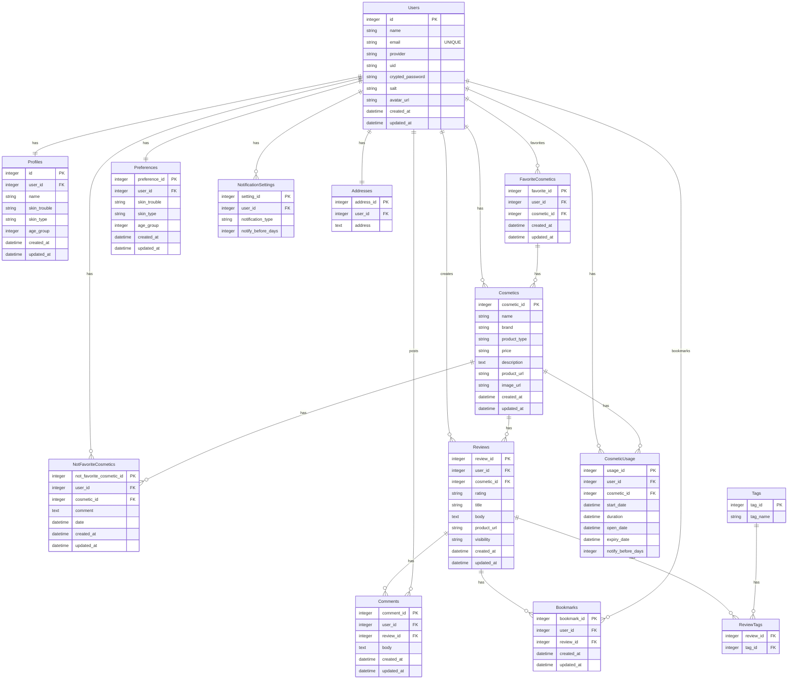

## ■画面遷移図
[画面遷移図](https://www.figma.com/file/re0Sf3bUsSQ52A4nPHaFA0/%E7%94%BB%E9%9D%A2%E9%81%B7%E7%A7%BB%E5%9B%B3?type=design&node-id=0%3A1&mode=design&t=jpVBer32Q4ftPUD8-1)

## ■ER図

## ■サービス概要
韓国コスメに特化した、ユーザーのスキンケアをサポートするサービスです。

具体的には、
- 韓国コスメを使用したことがないけれど興味がある方に向けて、お悩みや肌質別に韓国コスメを提案します。
- スキンケアコスメの買い忘れ・使用期限切れを防ぐサポートをします。
- お肌の大敵である紫外線や乾燥から、ユーザーのお肌を守るサポートをします。

## ■このサービスへの思い・作りたい理由
- 私自身、K-POPにハマったのをきっかけに韓国コスメにハマり、その良さを広めたいと思ったため
- 色々なスキンケアコスメを試すのが好きで、友人の悩みに合わせてコスメをおすすめしたり、スキンケアの話をするのが好きなため
- 私が好きな「韓国」と「スキンケア」の要素を掛け合わせることで、オリジナリティが出ると考えたため

## ■想定されるユーザー層
- 韓国コスメを使用したことがないけれど興味がある方
- 韓国コスメを使用してから日が浅い / 他にどんな韓国コスメがあるのか知りたい韓国コスメ初心者の方
- スキンケアについて悩みを抱えている方
- どのスキンケアコスメを選んだらいいか迷ってしまう方

韓国コスメに関してすでに知識がある方よりは、韓国コスメ初心者の方を主なターゲットとしたいと考えております。

## ■サービスの利用イメージ
- ユーザー一人ひとりに合ったレコメンド機能を提供することで、韓国コスメを使用したことがない方が最初の一歩を踏み出すきっかけづくりができればと考えております。
- LINE通知による「買い忘れ防止通知」「使用期限通知」「紫外線 / 乾燥注意通知」を受け取ることができたり、お気に入りのコスメや合わなかったコスメを記録しておくことで、ユーザーに自身のスキンケアについてより関心を持っていただき、ユーザーの皆さんの美肌づくりをサポートできたら嬉しいです。
- レビュー投稿機能を通して、他のユーザーが使用しているコスメの情報を知ることができたり、コメントをすることでユーザー同士のコミュニケーションを促せればと考えております。

## ■ユーザーの獲得について
- K-POPや韓国アイドルの日本での人気の高まりを受けて、韓国コスメを使用している、または使用したことがないけれど興味はある、という方は一定数いると考えております。SNSでの宣伝をはじめ、トップページでの診断機能や韓国コスメの良さをご説明することで、ユーザー登録を促せればと考えております。

## ■サービスの差別化ポイント・推しポイント
- 類似サービスとして「[アットコスメ（@cosme）](https://www.cosme.net/)」がありますが、本サービスでは韓国コスメに特化することで差別化を図りたいと考えております。
- アットコスメでは日本のコスメ（デパートコスメ・プチプラコスメなど）や韓国コスメなどさまざまな種類があり、スキンケアコスメだけでなくメイクアップコスメも取り扱っているため、情報量が多いところが魅力ですが、あえて韓国コスメのスキンケアコスメのみに特化することで、シンプルで見やすいUIを設計し、韓国コスメ初心者のユーザーにとって情報を取得しやすくできないかと考えております。
- アットコスメは基本的にユーザー自らがサービスにアクセスして情報を取得しにいきますが、本サービスではLINE通知を取り入れることでこちらから情報提供を行い、より手軽に使用していただける、ユーザー一人ひとりに寄り添ったサービスにできないかと考えております。

## ■MVPリリース時に実装を予定している機能
## 未ログインユーザー
### デモ診断
  - トップページにて、悩み・肌質・年代を選択していくと、それぞれに合った韓国コスメを提案
  - ログインせずにレコメンド機能をお試しいただき、ユーザー登録への導線をつくる
  - トップページ内に、韓国コスメを使用するメリットや人気の理由を記載

## ログインユーザー
### レコメンド
- 悩み・肌質・年代などを選択したら、それぞれに合った韓国コスメを提案
  - 悩み…乾燥、美白、ニキビ、毛穴など
  - 肌質…脂性肌、乾燥肌、混合肌、敏感肌など
  - 年代…10代〜60代くらいを予定
  - カテゴリごとにチェックボックスを用意して、ユーザーが選択→検索ボタンを押すと商品一覧が表示される想定

- 金額を入力したら、その価格帯の韓国コスメを提案
  - 単品もしくはセットかを選択できる
  - セットの場合は「化粧水＋美容液＋クリーム」セットを予定
  - 「〜5,000円以内」「〜1万円以内」のように選択式にして、ユーザーが選択→検索ボタンを押すと商品一覧が表示される想定

### LINE通知
- 買い忘れ防止通知：スキンケアコスメの使用開始日と、だいたい使い終わる日数をあらかじめ登録しておいたら「もうすぐなくなるから買っておいたほうがいいですよ」と通知
  - 登録日の何日前に通知するかを選択できるようにする
  - 使用開始日と容量で、ある程度使い終わる日を予想して、初期値を入れておくことも検討中
- 使用期限通知：スキンケアコスメの開封日と、使用期限をあらかじめ登録しておいたら「そろそろ替え時ですよ」と通知
  - 登録日の何日前に通知するかを選択できるようにする
- 紫外線 / 乾燥注意通知：住所を登録したら、天候に合わせて「今日はこれをするといいですよ（注意するといいですよ）」と通知
  - 紫外線に注意（日傘をさしたり、日焼け止めを塗りましょう）、乾燥に注意しましょうなど

### その他
- ユーザー登録
- ログイン / ログアウト
- パスワードリセット
- マイページ
  - プロフィール登録 / 編集 / 削除
  - 悩み・肌質・年代の登録 / 編集 / 削除

## ■本リリース時に実装を予定している機能
### レビュー投稿 / 編集 / 削除 / 一覧
- 掲示板形式にして、他のユーザーが投稿内容をもとに情報を得られるようにする
- ユーザーは使用した韓国コスメのレビューを投稿できる
- 個々のレビューが埋もれないようにするため、各商品ごとに専用のページを設け、そこに関連するすべてのレビューを集約する
- 投稿内に商品リンクを貼り、直接購入できるようにする
- レビューは５段階評価を予定
- 自分だけが見たい投稿と、他のユーザーも閲覧できる投稿で分けられるようにする
- ブックマーク / コメント
  - ユーザーは他のユーザーの投稿をブックマークできる
  - ユーザーは他のユーザーの投稿にコメントできる

### タグ付け / 検索
- 投稿に悩み・肌質・年代でタグを付けられ、ユーザーはタグで投稿を検索できる

### お気に入りコスメ登録 / 編集 / 削除 / 一覧（マイページ内）
- レコメンド機能でレコメンドされた韓国コスメのお気に入りと、他のユーザーのレビュー投稿のブックマークを合わせた一覧

### 合わなかったコスメ登録 / 編集 / 削除 / 一覧（マイページ内）
- 「このスキンケアコスメを使ったらニキビができた」など、スキンケアコスメの情報とコメントを記録できるようにする
- アプリ内でレコメンドされたスキンケアコスメ以外でも記録できる

### ランキング
- カテゴリ（悩み・肌質・年代）別にレビューの評価が高い順でランキング

### その他
- レビュー投稿のX（旧Twitter）シェア
- テスト（RSpec）

## ■現在検討している追加サービス案
- 人気の韓国コスメ、新しい韓国コスメ情報の提供
  - InstagramグラフAPIを使用し、ハッシュタグ「韓国スキンケア」の投稿を取得できないか検証中
  - 提供方法は、LINE通知、もしくはレビュー投稿一覧の中に私自身がInstagramグラフAPIから取得した情報を投稿して提供
- 韓国アイドルが使用している韓国コスメ情報の提供
  - APIなどによる情報の取得が難しいため、私自身が調査の上、レビュー投稿一覧の中に投稿して提供

## ■使用予定技術
|カテゴリ|技術|
|:-------------|:------------|
|開発環境|Docker|
|フロントエンド|React / Next.js|
|バックエンド|Ruby / Ruby on Rails 7系（API モード）|
|データベース|PostgreSQL|
|インフラ|Vercel / Render|
|Web API|楽天市場商品検索API / LINE Messaging API / OpenWeatherMap API / InstagramグラフAPI|
