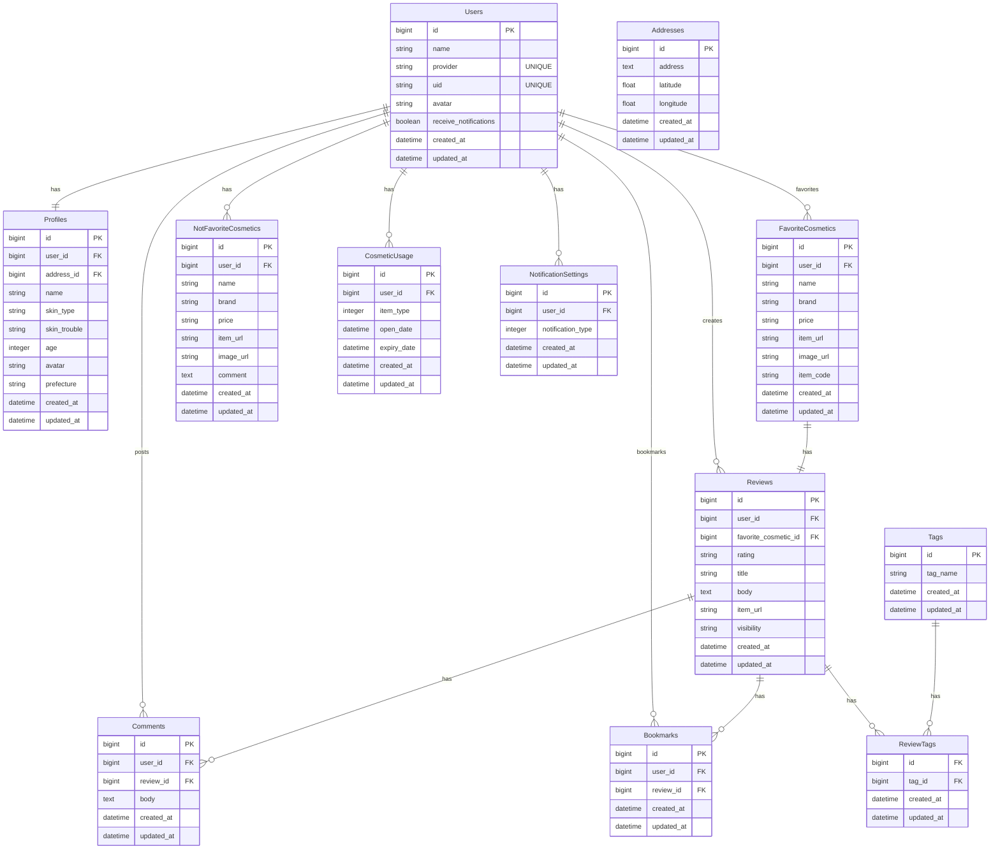

### KoreCare バックエンド用リポジトリ

## ■サービス概要
### [KoreCare](https://korecare.vercel.app/)
韓国コスメに特化した、ユーザーのスキンケアをサポートするサービスです。

具体的には、
- 韓国コスメを使用したことがないけれど興味がある方に向けて、肌質やお悩み別に韓国コスメを提案します。
- お肌の大敵である紫外線や乾燥から、ユーザーのお肌を守るサポートをします。
- スキンケアコスメの使用期限切れを防ぐサポートをします。

## ■このサービスへの思い・作りたい理由
- 私自身、K-POPにハマったのをきっかけに韓国コスメにハマり、その良さを広めたいと思ったため
- 色々なスキンケアコスメを試すのが好きで、友人の悩みに合わせてコスメをおすすめしたり、スキンケアの話をするのが好きなため
- 私が好きな「韓国」と「スキンケア」の要素を掛け合わせることで、オリジナリティが出ると考えたため

## ■想定されるユーザー層
- 韓国コスメを使用したことがないけれど興味がある方
- 韓国コスメを使用してから日が浅い / 他にどんな韓国コスメがあるのか知りたい韓国コスメ初心者の方
- スキンケアについて悩みを抱えている方
- どのスキンケアコスメを選んだらいいか迷ってしまう方

韓国コスメに関してすでに知識がある方よりは、韓国コスメ初心者の方を主なターゲットとしたいと考えております。

## ■サービスの利用イメージ
- 肌質やお悩み別の韓国コスメ検索機能、ユーザー一人ひとりに合ったレコメンド機能を提供することで、韓国コスメを使用したことがない方が最初の一歩を踏み出すきっかけづくりができればと考えております。
- LINE通知による「紫外線 / 乾燥注意通知」「使用期限通知」を受け取ることができたり、お気に入りのコスメや合わなかったコスメを記録しておくことで、ユーザーに自身のスキンケアについてより関心を持っていただき、ユーザーの皆さんの美肌づくりをサポートできたら嬉しいです。
- レビュー投稿機能を通して、他のユーザーが使用しているコスメの情報を知ることができたり、コメントをすることでユーザー同士のコミュニケーションを促せればと考えております。

## ■ユーザーの獲得について
- K-POPや韓国アイドルの日本での人気の高まりを受けて、韓国コスメを使用している、または使用したことがないけれど興味はある、という方は一定数いると考えております。SNSでの宣伝をはじめ、トップページでのデモ診断機能や、Q＆Aページにて韓国コスメの人気の理由、使い方をご説明することで、ユーザー登録を促せればと考えております。

## ■サービスの差別化ポイント・推しポイント
- 類似サービスとして「[アットコスメ（@cosme）](https://www.cosme.net/)」がありますが、本サービスでは韓国コスメに特化することで差別化を図りたいと考えております。
- アットコスメでは日本のコスメ（デパートコスメ・プチプラコスメなど）や韓国コスメなどさまざまな種類があり、スキンケアコスメだけでなくメイクアップコスメも取り扱っているため、情報量が多いところが魅力ですが、あえて韓国コスメのスキンケアコスメのみに特化することで、シンプルで見やすいUIを設計し、韓国コスメ初心者のユーザーにとって情報を取得しやすくできないかと考えております。
- アットコスメは基本的にユーザー自らがサービスにアクセスして情報を取得しにいきますが、本サービスではLINE通知を取り入れることでこちらから情報提供を行い、より手軽に使用していただける、ユーザー一人ひとりに寄り添ったサービスにできないかと考えております。

## ■MVPリリース時の機能
## 未ログインユーザー
### デモ診断
  - 肌質・お悩みを選択すると、それぞれに合った韓国コスメを表示
  - ログインせずに検索機能をお試しいただき、ユーザー登録への導線をつくる

## ログインユーザー
### 韓国コスメ検索
- 肌質・お悩み・形態・金額を選択したら、それぞれに合った韓国コスメを表示
  - 悩み…保湿、ニキビ、毛穴・黒ずみ、美白、肌のハリ・弾力
  - 肌質…乾燥肌、混合肌、脂性肌、普通肌、敏感肌
  - 形態…化粧水単品、美容液単品、クリーム単品、化粧水・美容液・クリームセット
  - 金額…「〜3,000円以内」「3,001円〜5,000円以内」「5,001円〜10,000円以内」「10,001円以上」

### LINE通知
- 紫外線 / 乾燥注意通知：住所を登録したら、天候に合わせて「今日はこれをするといいですよ（注意するといいですよ）」と通知
  - 紫外線に注意（日傘をさしたり、日焼け止めを塗りましょう）、保湿を心がけましょうなど

### お気に入りコスメ登録 / 削除 / 一覧
- レコメンド機能でレコメンドされた韓国コスメのお気に入り

### その他
- LINEログイン
- マイページ
  - プロフィール登録 / 編集 / 削除
  - 肌質・お悩み・年代の登録 / 編集 / 削除
- お気に入りコスメのX（旧Twitter）シェア

## ■本リリース時に実装を予定している機能
### LINE通知
- 使用期限通知：スキンケアコスメの開封日と、使用期限をあらかじめ登録しておいたら「そろそろ替え時ですよ」と通知
  - 登録日の何日前に通知するかを選択できるようにする

### レコメンド
- ユーザーが検索した商品に関連する商品を検索結果ページに表示
- プロフィールにて設定していただいた「肌質」「お悩み」に関連する商品を紹介

### レビュー投稿 / 編集 / 削除 / 一覧
- 掲示板形式にして、他のユーザーが投稿内容をもとに情報を得られるようにする
- ユーザーは使用した韓国コスメのレビューを投稿できる
- 個々のレビューが埋もれないようにするため、各商品ごとに専用のページを設け、そこに関連するすべてのレビューを集約する
- 投稿内に商品リンクを貼り、直接購入できるようにする
- レビューは５段階評価を予定
- 自分だけが見たい投稿と、他のユーザーも閲覧できる投稿で分けられるようにする
- ブックマーク / コメント
  - ユーザーは他のユーザーの投稿をブックマークできる
  - ユーザーは他のユーザーの投稿にコメントできる

### レビュー投稿のブックマーク登録 / 編集 / 削除 / 一覧
- 他のユーザーのレビュー投稿のブックマークを合わせた一覧

### タグ付け / 検索
- 投稿に肌質・お悩み・年代でタグを付けられ、ユーザーはタグで投稿を検索できる

### 合わなかったコスメ登録 / 編集 / 削除 / 一覧
- 「このスキンケアコスメを使ったらニキビができた」など、スキンケアコスメの情報とコメントを記録できるようにする
- アプリ内でレコメンドされたスキンケアコスメ以外でも記録できる

### その他
- レビュー投稿のX（旧Twitter）シェア
- テスト（RSpec）

## ■現在検討している追加サービス案
- 人気の韓国コスメ、新しい韓国コスメ、メガ割などのセール情報の提供
- 韓国アイドルが使用している韓国コスメ情報の提供
  - 提供方法は、LINE通知もしくはレビュー投稿一覧の中に私自身が調査の上、情報を投稿して提供

## ■使用技術
|カテゴリ|技術|
|:-------------|:------------|
|フロントエンド|TypeScript 5.3.3 / React 18.2 / Next.js 14.0.4|
|バックエンド|Ruby 3.2.2 / Ruby on Rails 7.0.8（API モード）|
|データベース|PostgreSQL|
|認証|NextAuth.js|
|環境構築|Docker|
|インフラ|Vercel / Render|
|Web API|楽天市場商品検索API / LINE Messaging API / OpenWeatherMap API|

## ■画面遷移図
[画面遷移図](https://www.figma.com/file/re0Sf3bUsSQ52A4nPHaFA0/%E7%94%BB%E9%9D%A2%E9%81%B7%E7%A7%BB%E5%9B%B3?type=design&node-id=0%3A1&mode=design&t=jpVBer32Q4ftPUD8-1)

## ■ER図
