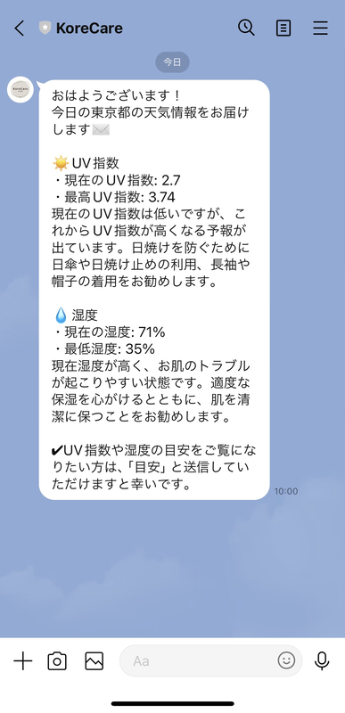
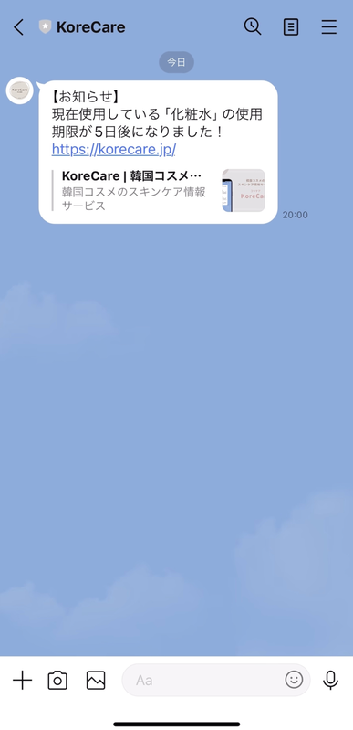
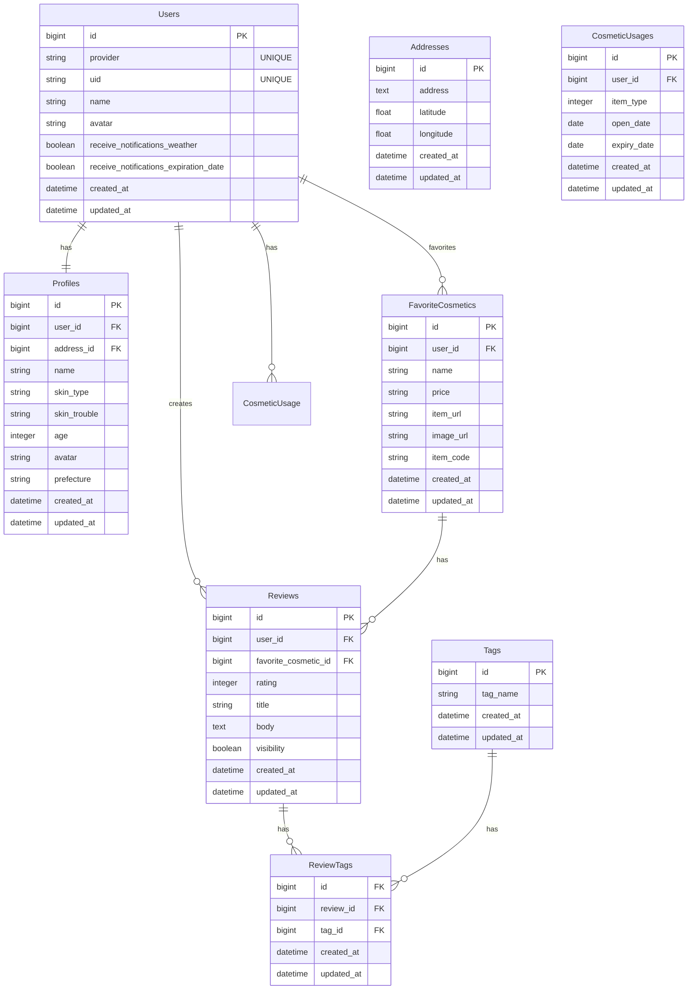

## KoreCare フロントエンド用リポジトリ

## ■サービス名
### [KoreCare（コリケア）](https://korecare.jp/)
お試し機能を実装しましたので、ログインせずにお試しいただくこともできます。

## ■サービス概要
韓国コスメに特化した、スキンケア情報サービスです。

具体的には、
- 肌質やお悩み別に韓国コスメを提案します。
- お肌の大敵である紫外線や乾燥から、ユーザーのお肌を守るサポートをします。
- スキンケアコスメの使用期限切れを防ぐサポートをします。

## ■このサービスへの思い・作りたい理由
- 私自身、K-POPにハマったのをきっかけに韓国コスメにハマり、その良さを広めたいと思ったため
- 色々なスキンケアコスメを試すのが好きで、友人の悩みに合わせてコスメをおすすめしたり、スキンケアの話をするのが好きなため
- 私が好きな「韓国」と「スキンケア」の要素を掛け合わせることで、オリジナリティが出ると考えたため

## ■想定されるユーザー層
- 韓国コスメを使用したことがないけれど興味がある方
- 韓国コスメを使用してから日が浅い / 他にどんな韓国コスメがあるのか知りたい韓国コスメ初心者の方
- スキンケアについて悩みを抱えている方
- どのスキンケアコスメを選んだらいいか迷ってしまう方

韓国コスメに関してすでに知識がある方よりは、韓国コスメ初心者の方を主なターゲットとしております。

## ■サービスの利用イメージ
- 肌質やお悩み別の韓国コスメ検索機能、ユーザー一人ひとりに合ったレコメンド機能を提供することで、韓国コスメを使用したことがない方が最初の一歩を踏み出すきっかけづくりができればと考えております。
- LINE通知による「紫外線 / 乾燥注意通知」「使用期限通知」を受け取ることができたり、お気に入りのコスメを記録しておくことで、ユーザーに自身のスキンケアについてより関心を持っていただき、ユーザーの皆さんの美肌づくりをサポートできたら嬉しいです。

## ■ユーザーの獲得について
- K-POPや韓国アイドルの日本での人気の高まりを受けて、韓国コスメを使用している、または使用したことがないけれど興味はある、という方は一定数いると考えております。SNSでの宣伝をはじめ、トップページでのお試し検索機能や、Q＆Aページにて韓国コスメの人気の理由、使い方をご説明することで、ユーザー登録を促せればと考えております。

## ■サービスの差別化ポイント・推しポイント
- 類似サービスとして「[アットコスメ（@cosme）](https://www.cosme.net/)」がありますが、本サービスでは韓国コスメに特化することで差別化を図りたいと考えております。
- アットコスメでは日本のコスメ（デパートコスメ・プチプラコスメなど）や韓国コスメなどさまざまな種類があり、スキンケアコスメだけでなくメイクアップコスメも取り扱っているため、情報量が多いところが魅力ですが、あえて韓国コスメのスキンケアコスメのみに特化することで、シンプルで見やすいUIを設計し、韓国コスメ初心者のユーザーにとって情報を取得しやすくできないかと考えております。
- アットコスメは基本的にユーザー自らがサービスにアクセスして情報を取得しにいきますが、本サービスではLINE通知を取り入れることでこちらから情報提供を行い、より手軽に使用していただける、ユーザー一人ひとりに寄り添ったサービスにできないかと考えております。

## ■機能一覧
|お試し韓国コスメ検索機能|韓国コスメ検索機能|
|:-------------|:-------------|
|||
|肌質・お悩みを選択すると、それぞれに合った韓国コスメを表示します。|肌質・お悩み・形態・金額を選択すると、それぞれに合った韓国コスメを表示します。|

|レコメンド機能（1）|レコメンド機能（2）|
|:-------------|:-------------|
|||
|ユーザーが選択したキーワードに関連する商品を表示します。|プロフィールにて設定していただいた肌質・お悩みに関連する商品を表示します。|

|お気に入りコスメ登録機能|お気に入りコスメ一覧機能|
|:-------------|:-------------|
|||
|検索したコスメやレコメンドされたコスメをお気に入りに登録できます。|マイページ内でお気に入りに登録したコスメを確認できます。|

|紫外線/乾燥注意通知機能（設定）|使用期限通知機能（設定）|
|:-------------|:-------------|
|||
|マイページにて設定していただいたお住まいのUV指数と湿度の情報を毎朝10時に通知します。|コスメの製品タイプ、開封日、使用期限を設定していただくと、使用期限の5日前・3日前・前日に通知します。|

|紫外線/乾燥注意通知機能（通知画面）|使用期限通知機能（通知画面）|
|:-------------|:-------------|
|||
|実際の通知画面です。|実際の通知画面です。|

|レビュー投稿/一覧機能|レビュー編集/削除機能|
|:-------------|:-------------|
|||
|お気に入りに登録したコスメのレビューを投稿できます。|レビューの編集や削除も可能です。|

|レビュー検索機能|ログイン/ログアウト機能|
|:-------------|:-------------|
|||
|レビュー投稿時に付けられたタグ（肌質、お悩み、年代）により、該当するレビューを検索できます。|NextAuth.jsを使用したLINEログインが可能です。|

|現在の天気/UV指数/湿度の表示機能|Q＆A|
|:-------------|:-------------|
|||
|OpenWeatherMap APIを使用し、現在の天気、UV指数、湿度の情報を表示しています。|韓国コスメの人気の理由、使い方をご説明しています。|

|お気に入りコスメのXシェア機能|レビュー投稿のXシェア機能|
|:-------------|:-------------|
|||
|お気に入りコスメのXへのシェアができます。|レビュー投稿のXへのシェアができます。|

## ■今後の開発について
### ランキング機能
お気に入りの数が多い順や、レビュー評価の高い順でのランキング機能を実装したいと考えています。

### テスト（RSpec）
まだまだテストコードが書けていないので、カバレッジ率を上げていきたいです。

## ■使用技術
|カテゴリ|技術|
|:-------------|:------------|
|フロントエンド|TypeScript 5.3.3 / React 18.2 / Next.js 14.0.4|
|バックエンド|Ruby 3.2.2 / Ruby on Rails 7.0.8（API モード）|
|データベース|PostgreSQL|
|認証|NextAuth.js|
|環境構築|Docker|
|インフラ|Vercel / Render|
|Web API|楽天市場商品検索API / LINE Messaging API / OpenWeatherMap API|
|その他|SWR / shadcn/ui / Sidekiq / Redis / ActiveJob|

## ■インフラ構成

## ■画面遷移図
[画面遷移図](https://www.figma.com/file/re0Sf3bUsSQ52A4nPHaFA0/%E7%94%BB%E9%9D%A2%E9%81%B7%E7%A7%BB%E5%9B%B3?type=design&node-id=0%3A1&mode=design&t=jpVBer32Q4ftPUD8-1)

## ■ER図
